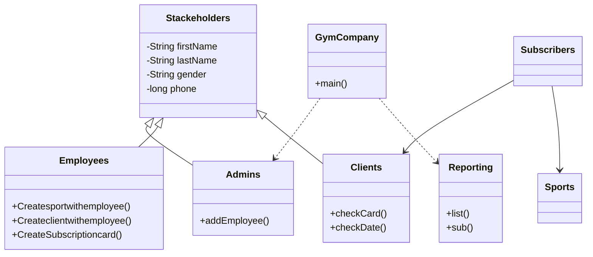

# GymCompany

تطبيق **واجهة سطر أوامر (Console)** لإدارة شركة نادي رياضي، مطوّر بلغة **Java** ضمن مشروع جامعي لمادة **البرمجة كائنية التوجّه (OOP)**.

يدعم النظام إدارة الموظفين والعملاء والرياضات والاشتراكات، مع تقارير بسيطة حسب نوع العضوية وعدد المشتركين في كل رياضة.

---

## المميزات

- إضافة موظفين من قبل المدير (Admin)
- تسجيل دخول الموظف (اسم مستخدم + كلمة مرور) لإضافة:
  - رياضات (اسم، قاعة، أماكن، وقت، مدرب، سعر)
  - عملاء (بيانات شخصية + بطاقة عضوية بتواريخ بداية/نهاية)
  - اشتراكات ربط العميل برياضات متعددة
- تصنيف العضوية تلقائياً:
  - **normal** — رياضة واحدة
  - **silver** — رياضتان (خصم 10%)
  - **gold** — أكثر من رياضتين (خصم 15%)
- عرض تقارير: كل العملاء، الرياضات ذات أقل من 3 مشتركين، المشتركين، تفاصيل عميل برقم البطاقة

---

## مفاهيم OOP المستخدمة

| المفهوم | التطبيق في المشروع |
|--------|---------------------|
| **التوريث (Inheritance)** | `Admins`، `Employees`، `Clients` ترث من `Stackeholders` |
| **التغليف (Encapsulation)** | حقول خاصة مع getters/setters |
| **تعدد الأشكال (Polymorphism)** | `toString()` مخصّص في كل فئة |
| **التركيب (Composition)** | `Subscribers` يحتوي `Clients` وقائمة `Sports` |
| **المجموعات (Collections)** | `ArrayList` لتخزين البيانات في الذاكرة |

### هيكل الفئات



---

## هيكل المشروع

```
GymCompany/
├── src/gymcompany/
│   ├── GymCompany.java    # نقطة الدخول والقائمة الرئيسية
│   ├── Stackeholders.java # الفئة الأساسية
│   ├── Admins.java
│   ├── Employees.java
│   ├── Clients.java
│   ├── Sports.java
│   ├── Subscribers.java
│   └── Reporting.java
├── nbproject/             # إعدادات Apache NetBeans
├── build.xml
└── README.md
```

---

## المتطلبات

- **Java 20** أو أحدث (حسب إعدادات المشروع في `nbproject/project.properties`)
- **Apache NetBeans** (اختياري — المشروع مُنشأ من NetBeans)

---

## التشغيل

### من Apache NetBeans

1. افتح المجلد `GymCompany` كمشروع NetBeans
2. شغّل الملف `GymCompany.java` (Run Project — F6)

### من سطر الأوامر

```bash
cd GymCompany
javac -d build/classes -sourcepath src src/gymcompany/*.java
java -cp build/classes gymcompany.GymCompany
```

> على Windows يمكنك أيضاً استخدام `ant run` إذا كان Apache Ant مثبتاً ومتصلاً بـ `build.xml`.

---

## القائمة التفاعلية

عند التشغيل تظهر الخيارات التالية:

| الرقم | الوظيفة |
|------|---------|
| `0` | الخروج |
| `1` | إضافة موظف (مدير) |
| `2` | إضافة رياضة (موظف — يتطلب تسجيل دخول) |
| `3` | إضافة عميل (موظف) |
| `4` | إنشاء/تحديث اشتراك عميل برياضات |
| `5` | عرض جميع العملاء |
| `6` | عرض الرياضات التي يشارك فيها أقل من 3 عملاء |
| `7` | عرض جميع المشتركين |
| `8` | عرض الرياضة المرتبطة برقم بطاقة |
| `9` | عرض معلومات العميل والاشتراك برقم البطاقة |

---

## ملاحظات

- البيانات تُخزَّن في **الذاكرة فقط** (`ArrayList`) ولا تُحفظ في ملف أو قاعدة بيانات — عند إغلاق البرنامج تُفقد البيانات.
- المشروع تعليمي؛ لا يُنصح باستخدامه في بيئة إنتاج دون تحسينات (قاعدة بيانات، تشفير كلمات المرور، واجهة مستخدم، إلخ).

---

## المؤلف

**عمر خليل** — مشروع مادة OOP / OOPL

---

## الترخيص

مشروع أكاديمي — يمكنك تعديل الترخيص حسب متطلبات الجامعة أو إضافة ملف `LICENSE` عند الرفع على GitHub.
