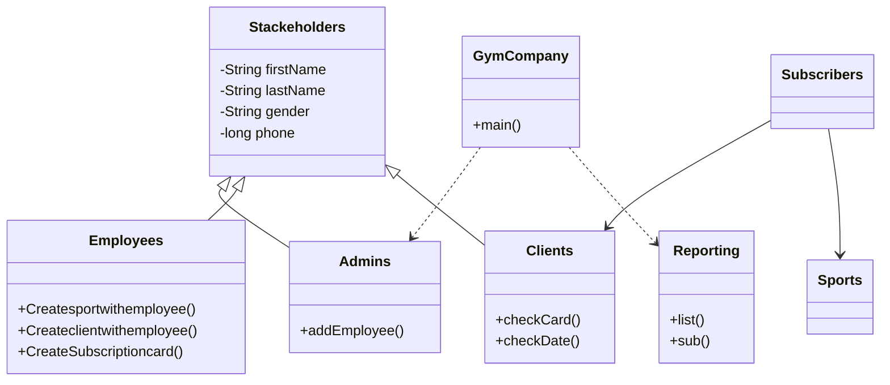

# GymCompany

A **Console (Command Line Interface)** application for managing a fitness club company, developed in **Java** as part of a university project for the **Object-Oriented Programming (OOP)** course.

The system supports the management of employees, clients, sports, and subscriptions, along with simple reports based on membership type and the number of subscribers in each sport.

---

## Features

- Adding employees by the Manager (Admin)
- Employee login (username + password) to add:
  - Sports (name, hall, slots, time, coach, price)
  - Clients (personal details + membership card with start/end dates)
  - Subscriptions linking a client to multiple sports
- Automatic membership classification:
  - **normal** — one sport
  - **silver** — two sports (10% discount)
  - **gold** — more than two sports (15% discount)
- Displaying reports: All clients, sports with fewer than 3 subscribers, subscribers, client details by card number

---

## OOP Concepts Used

| Concept | Application in the Project |
|--------|---------------------|
| **Inheritance** | `Admins`, `Employees`, `Clients` inherit from `Stackeholders` |
| **Encapsulation** | Private fields with getters/setters |
| **Polymorphism** | Customized `toString()` in each class |
| **Composition** | `Subscribers` contains `Clients` and a list of `Sports` |
| **Collections** | `ArrayList` for storing data in memory |

### Class Structure



---

## Project Structure

```
GymCompany/
├── src/gymcompany/
│   ├── GymCompany.java    # Entry point and main menu
│   ├── Stackeholders.java # Base class
│   ├── Admins.java
│   ├── Employees.java
│   ├── Clients.java
│   ├── Sports.java
│   ├── Subscribers.java
│   └── Reporting.java
├── nbproject/             # Apache NetBeans configuration
├── build.xml
└── README.md

```

---

## Requirements

* **Java 20** or newer (depending on the project settings in `nbproject/project.properties`)
* **Apache NetBeans** (Optional — the project is created using NetBeans)

---

## Running the Application

### From Apache NetBeans

1. Open the `GymCompany` folder as a NetBeans project
2. Run the `GymCompany.java` file (Run Project — F6)

### From the Command Line

```bash
cd GymCompany
javac -d build/classes -sourcepath src src/gymcompany/*.java
java -cp build/classes gymcompany.GymCompany

```

> On Windows, you can also use `ant run` if Apache Ant is installed and linked to `build.xml`.

---

## Interactive Menu

When executed, the following options are displayed:

| Number | Function |
| --- | --- |
| `0` | Exit |
| `1` | Add an employee (Admin) |
| `2` | Add a sport (Employee — login required) |
| `3` | Add a client (Employee) |
| `4` | Create/update a client's subscription to sports |
| `5` | View all clients |
| `6` | View sports with fewer than 3 participating clients |
| `7` | View all subscribers |
| `8` | View the sport associated with a card number |
| `9` | View client and subscription information by card number |

---

## Notes

* Data is stored in **memory only** (`ArrayList`) and is not saved to a file or database — data will be lost when the program is closed.
* This is an educational project; it is not recommended for production use without improvements (database, password encryption, user interface, etc.).

---

## Author

**Omar Khalil** — OOP / OOPL Course Project

```

```