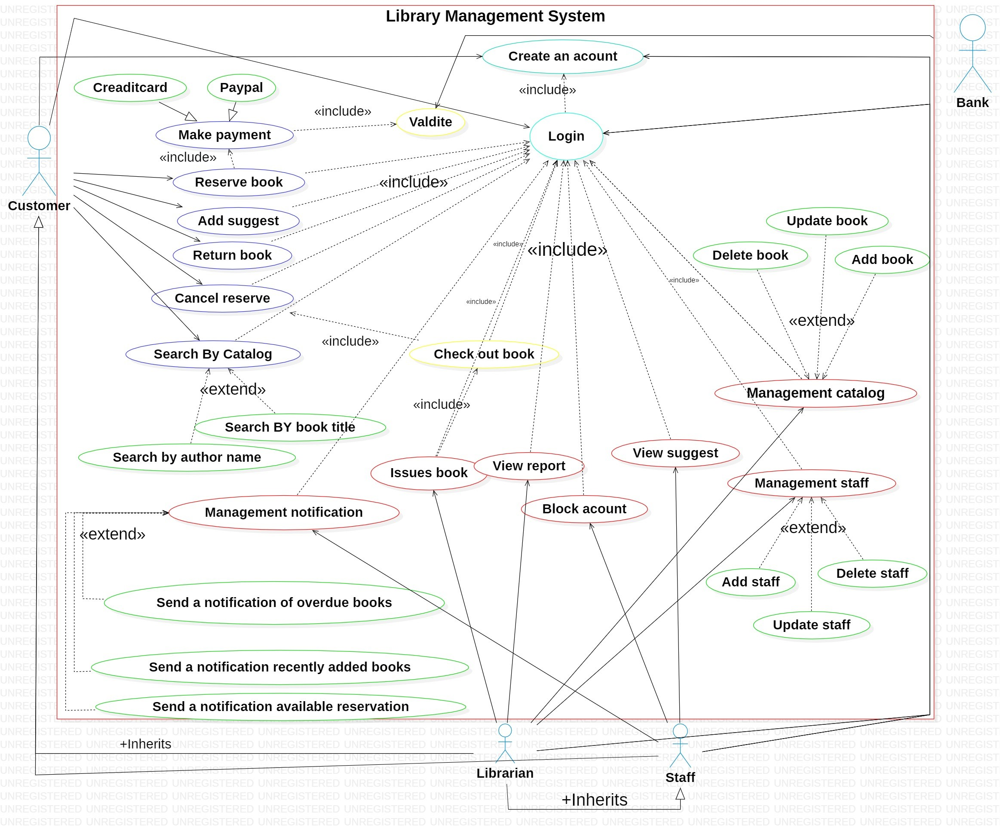
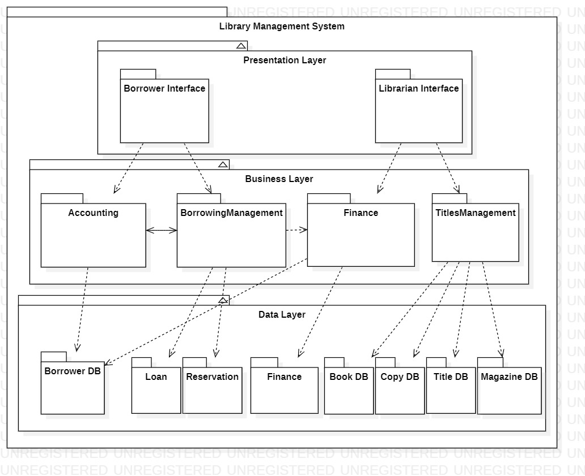
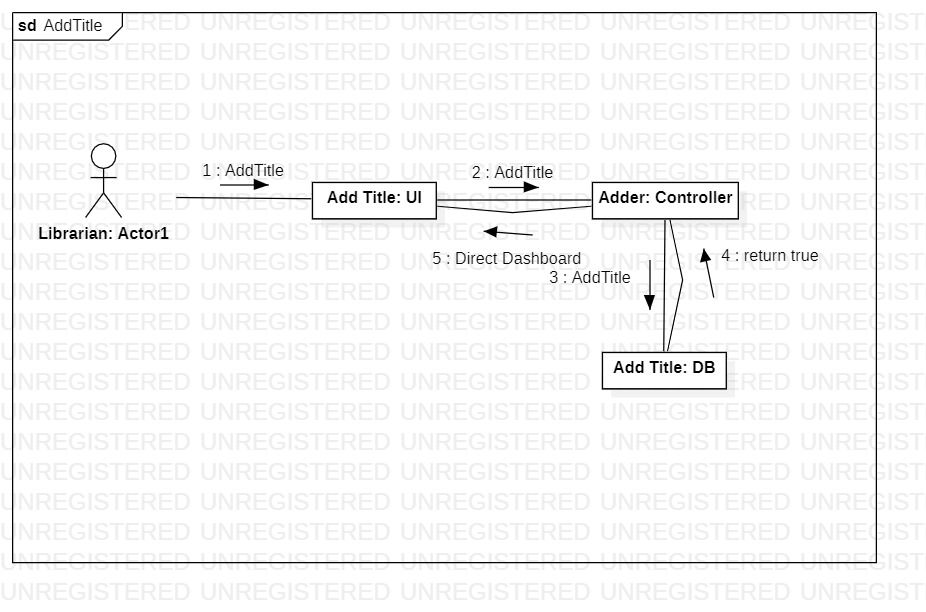
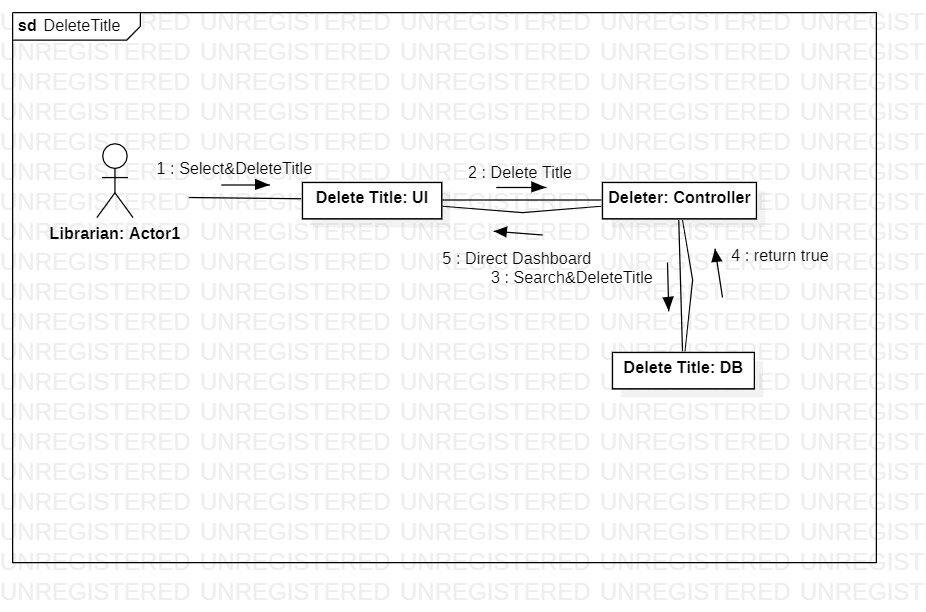
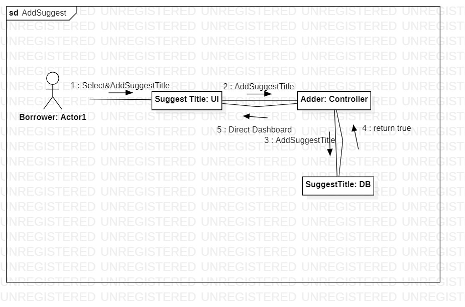
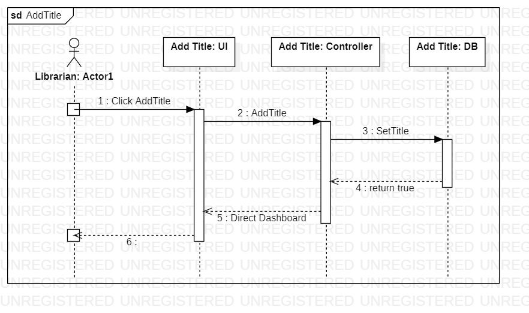
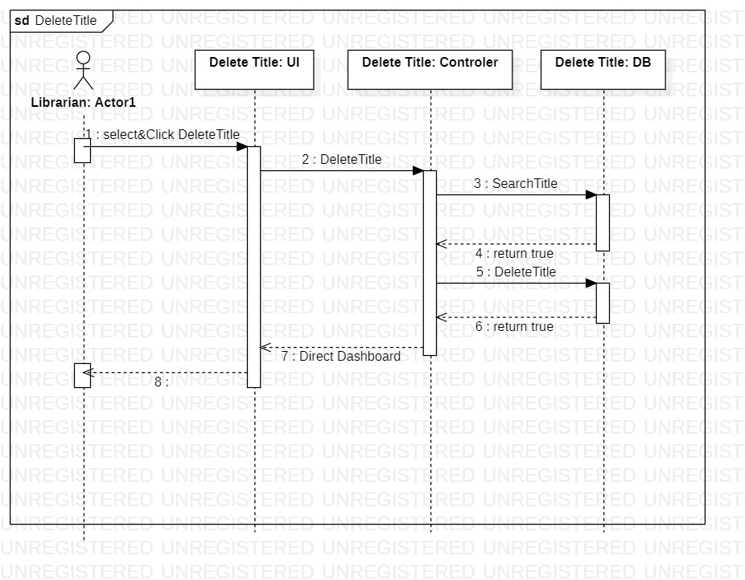
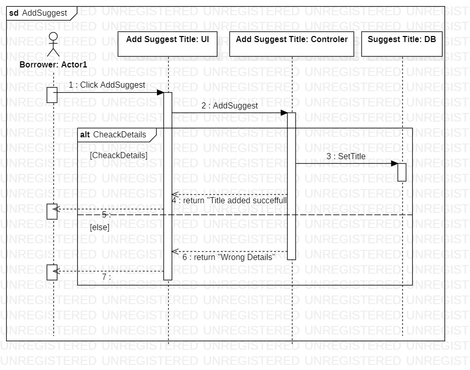
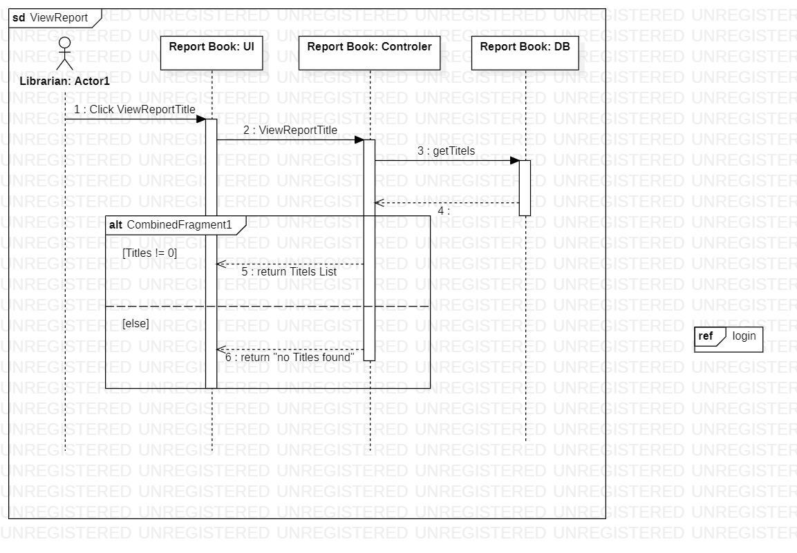

## 📐 Software Architecture & Design

This system is designed using structured analysis and object-oriented modeling techniques to ensure scalability, robust performance, and seamless maintainability.

### 1. Requirements Modeling
* **Use Case Diagram:** Defines the system boundaries, roles (Customer, Librarian, Staff), and core operational workflows available to each actor.
  

### 2. Data Flow Architecture (DFD)
* **Context Diagram (Level 0):** Shows high-level interactions between the system and external entities (Customer, Librarian, Staff, Bank).
  
* **Level 1 DFD:** Breaks down core system components into primary processes (Account Creation, Loans Management, Financial Transactions, and Suggestions Management).
  
* **Level 2 DFD:** Provides granular detailing for backend catalog searching and new book suggestion processing.
  

### 3. Structural Modeling
* **Package Diagram:** Illustrates the high-level architectural layering and dependencies between the User Interface, Business Logic, and Database Access packages.
  
* **Class Diagram:** Represents the object-oriented backbone of the database and code, detailing classes such as `Borrower`, `Account`, `Loan`, `Copy`, and `Titles`, along with their attributes, methods, and structural relationships.
  

### 4. Behavioral & Dynamic Modeling

#### A) State Machine Diagrams
* **Account Status:** Tracks dynamic shifts throughout a user profile's lifecycle (Active, Late, Suspended, Closed).
  
* **Book Status:** Monitors the availability and physical condition of book copies within the facility (Available, On Loan, Reserved, Removed).
  
* **Loan Status:** Manages the active borrowing cycle lifecycle from checkout to return or loss declaration.
  

#### B) Sequence Diagrams
The sequence diagrams are divided into two structural levels to ensure clarity in business logic and execution-level details:

##### 1. High-Level Workflows (Horizontal/Compact View)
Streamlined diagrams showing straightforward message routing between the UI, Controller, and Database for quick business logic mapping:
* **Add Title (Simple):** 
* **Delete Title (Simple):** 
* **Add Suggestion (Simple):** 

##### 2. Low-Level Implementation (Vertical/Detailed View)
Detailed execution-level diagrams illustrating lifeline block durations, conditional logic fragment loops (`alt`), and rigorous backend validation checks:
* **Add Title (Detailed):** 
* **Delete Title (Detailed):** 
* **Add Suggestion (With Verification):** 
* **View & Generate Reports:** 

